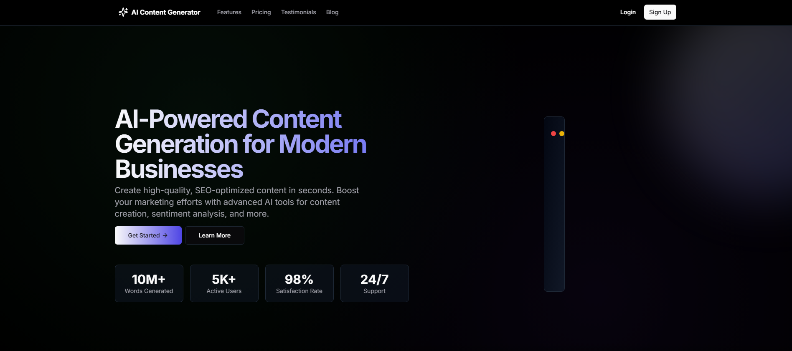
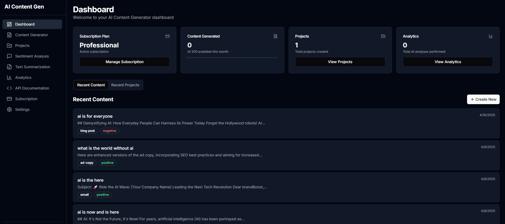

# AI Content Generator SaaS Platform

A powerful SaaS platform that leverages AI to automate content creation, improve SEO, and provide valuable insights into customer sentiment.
#### Landing Page View

#### Dashboard View


#### login to see more of our content!!!


## 🚀 Features

- **AI-Powered Content Generation**: Create high-quality, human-like text for product descriptions, blog articles, email templates, and social media posts using Gemini-2.0-Flash.
- **Sentiment Analysis**: Analyze text for positive, neutral, or negative sentiments using Hugging Face API.
- **Keyword Extraction**: Extract important keywords and phrases from content to improve SEO.
- **Text Summarization**: Automatically generate summaries of long-form content.
- **Project Management**: Organize content into projects for better workflow management.
- **Analytics Dashboard**: Visualize content performance, sentiment distribution, and keyword trends.
- **API Access**: Integrate AI content generation capabilities into third-party applications.
- **Subscription Management**: Tiered subscription plans with PayPal integration.

## 🛠️ Tech Stack

- **Frontend**: Next.js 14 with App Router, React, Tailwind CSS, shadcn/ui
- **Backend**: Next.js API Routes, Server Actions
- **Database**: PostgreSQL with Supabase
- **Authentication**: Supabase Auth
- **AI Services**:
  - Gemini-2.0-Flash or higher models for content generation
  - Hugging Face API for NLP tasks (sentiment analysis, keyword extraction, summarization)
- **Payments**: PayPal Subscriptions API
- **Visualization**: Recharts for analytics
- **Styling**: Tailwind CSS with custom theming

## 📋 Prerequisites

- Node.js 18.x or higher
- npm or yarn
- Supabase account
- Gemini API key
- Hugging Face API key
- PayPal Sandbox or live Developer account

## 🚀 Getting Started

### Installation

1. Clone the repository:
  ```
  git clone https://github.com/MeeksonJr/ai-content-generator.git
  cd ai-content-generator
  ```

2. Install dependencies:
  ```
   npm install
   # or
   yarn install
  ```
3. Set up environment variables:
   Create a `.env.local` file in the root directory with the following variables:
   
   # Supabase
   NEXT_PUBLIC_SUPABASE_URL=your_supabase_url
   NEXT_PUBLIC_SUPABASE_ANON_KEY=your_supabase_anon_key
   SUPABASE_SERVICE_ROLE_KEY=your_supabase_service_role_key
   
   # AI Services
   GEMINI_API_KEY=your_gemini_api_key
   NEXT_PUBLIC_GEMINI_API_KEY=your_gemini_api_key
   HUGGING_FACE_API_KEY=your_huggingface_api_key
   
   # PayPal
   PAYPAL_CLIENT_ID=your_paypal_client_id
   PAYPAL_CLIENT_SECRET=your_paypal_client_secret
   
   # App URL
   NEXT_PUBLIC_APP_URL=http://localhost:3000
   \`\`\`

4. Set up the database:
   Run the SQL scripts in the `sql` directory to create the necessary tables and seed data.

5. Start the development server:
   \`\`\`bash
   npm run dev
   # or
   yarn dev
   \`\`\`

6. Open [http://localhost:3000](http://localhost:3000) in your browser.

## 📊 Database Schema

The application uses the following main tables:

- **users**: User accounts (managed by Supabase Auth)
- **projects**: Content projects created by users
- **content**: Generated content items
- **subscriptions**: User subscription information
- **usage_limits**: Limits based on subscription plans
- **usage_stats**: Usage statistics for users

## 🔑 API Documentation

### Content Generation API

\`\`\`
POST /api/v1/generate
\`\`\`

Generate AI content based on provided parameters.

**Headers:**
- `Authorization: Bearer YOUR_API_KEY`
- `Content-Type: application/json`

**Request Body:**
\`\`\`json
{
  "contentType": "product_description",
  "title": "Wireless Bluetooth Headphones",
  "prompt": "High-quality noise-canceling headphones with 20-hour battery life"
}
\`\`\`

**Response:**
\`\`\`json
{
  "content": "Experience audio like never before with our Wireless Bluetooth Headphones...",
  "sentiment": "positive",
  "sentimentScore": 0.92,
  "keywords": [
    { "keyword": "wireless", "score": 0.85 },
    { "keyword": "bluetooth", "score": 0.82 },
    { "keyword": "headphones", "score": 0.95 }
  ]
}
\`\`\`

### Sentiment Analysis API

\`\`\`
POST /api/v1/sentiment
\`\`\`

Analyze the sentiment of provided text.

**Headers:**
- `Authorization: Bearer YOUR_API_KEY`
- `Content-Type: application/json`

**Request Body:**
\`\`\`json
{
  "text": "I absolutely love this product! It's amazing and works perfectly."
}
\`\`\`

**Response:**
\`\`\`json
{
  "sentiment": "positive",
  "score": 0.95
}
\`\`\`

### Keyword Extraction API

\`\`\`
POST /api/v1/keywords
\`\`\`

Extract keywords from provided text.

**Headers:**
- `Authorization: Bearer YOUR_API_KEY`
- `Content-Type: application/json`

**Request Body:**
\`\`\`json
{
  "text": "Artificial intelligence is transforming digital marketing strategies for e-commerce businesses."
}
\`\`\`

**Response:**
\`\`\`json
{
  "keywords": [
    { "keyword": "artificial intelligence", "score": 0.92 },
    { "keyword": "digital marketing", "score": 0.87 },
    { "keyword": "e-commerce", "score": 0.85 },
    { "keyword": "strategies", "score": 0.76 }
  ]
}
\`\`\`

### Text Summarization API

\`\`\`
POST /api/v1/summarize
\`\`\`

Generate a concise summary of longer text.

**Headers:**
- `Authorization: Bearer YOUR_API_KEY`
- `Content-Type: application/json`

**Request Body:**
\`\`\`json
{
  "text": "Lorem ipsum dolor sit amet, consectetur adipiscing elit...",
  "maxLength": 150
}
\`\`\`

**Response:**
\`\`\`json
{
  "summary": "A concise summary of the provided text..."
}
\`\`\`

## 📱 Pages and Components

- **Landing Page**: Introduction to the platform and its features
- **Authentication**: Login and registration pages
- **Dashboard**: Overview of user's content and analytics
- **Content Generator**: AI-powered content creation interface
- **Projects**: Project management for organizing content
- **Sentiment Analysis**: Tool for analyzing text sentiment
- **Keyword Extraction**: Tool for extracting keywords from text
- **Text Summarization**: Tool for summarizing long-form content
- **API Documentation**: Documentation for the API endpoints
- **Subscription Management**: Manage subscription plans and billing

## 🔒 Authentication and Authorization

The application uses Supabase Auth for authentication and Row Level Security (RLS) policies for authorization. This ensures that users can only access their own data and resources.

## 💰 Subscription Plans

The platform offers three subscription tiers:

1. **Free Plan**:
   - 5 content generations per month
   - 1,000 character limit
   - No advanced features

2. **Professional Plan** ($19.99/month):
   - 50 content generations per month
   - 5,000 character limit
   - Sentiment analysis
   - Keyword extraction
   - Text summarization

3. **Enterprise Plan** ($49.99/month):
   - Unlimited content generations
   - 10,000 character limit
   - All advanced features
   - API access

## 🧪 Testing

Run the test suite with:
```
bash
npm test
or
yarn test
```
## 🚀 Deployment

The application can be deployed to Vercel with the following steps:

1. Push your code to a GitHub repository.
2. Create a new project on Vercel and link it to your repository.
3. Configure the environment variables in the Vercel dashboard.
4. Deploy the application.

## 📄 License

This project is licensed under the MIT License - see the [LICENSE](LICENSE) file for details.

## 👥 Contributors

- [Mohamed Datt](https://github.com/MeeksonJr/)

## 🙏 Acknowledgements

- [Next.js](https://nextjs.org/)
- [Supabase](https://supabase.io/)
- [Tailwind CSS](https://tailwindcss.com/)
- [shadcn/ui](https://ui.shadcn.com/)
- [Gemini AI](https://gemini.google.com/)
- [Hugging Face](https://huggingface.co/)
- [PayPal](https://developer.paypal.com/)
- [Recharts](https://recharts.org/)
